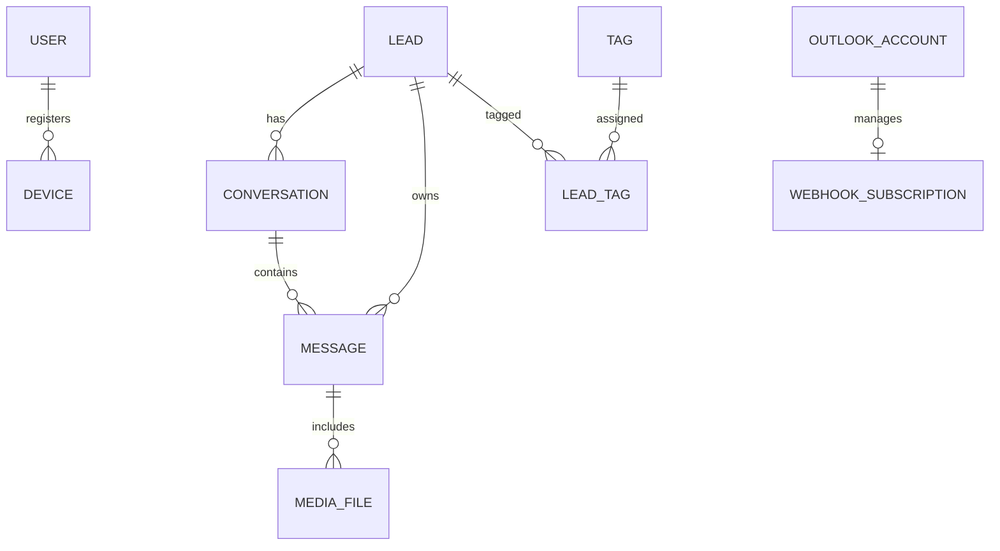

<div align="center">

# 🚀 AI-Driven Omnichannel CRM
### Intelligent Lead Management & AI-Powered Customer Communication Platform


An AI-powered CRM platform that centralizes WhatsApp and Outlook communications into a single intelligent backend.

</div>

---

# 📖 Table of Contents

- Overview
- Key Features
- System Architecture
- Technology Stack
- Project Structure
- Database Architecture
- Environment Variables
- Installation Guide
- Running Background Services
- API Documentation
- Folder Overview
- Development Commands
- Future Roadmap
- License

---

# 📌 Project Overview

**AI-Driven Omnichannel CRM** is a modern SaaS backend built using **Django** and **Django REST Framework**.

The system connects multiple communication channels including:

- Meta WhatsApp Business API
- Microsoft Outlook Graph API

It automatically receives customer messages, stores conversations, analyzes inquiries using AI, generates intelligent responses, and maintains complete CRM history.

The platform is designed for businesses that need a centralized customer communication system with AI automation.

---

# ✨ Key Features

## 📱 WhatsApp Integration

- Meta Graph API Integration
- Webhook Verification
- Incoming Message Processing
- Outgoing Message Sending
- Delivery Status Tracking
- Read Receipts
- Image Support
- Document Support
- Media Download
- Quality Rating Management

---

## 📧 Outlook Integration

- Microsoft Graph API
- OAuth Token Management
- Auto Token Refresh
- Email Synchronization
- Conversation Threading
- AI Email Reply
- Outlook Webhook Subscription
- Attachment Processing

---

## 🤖 AI Integration

- AI Inquiry Analysis
- Conversation Context
- Auto Reply Generation
- Intent Detection
- Lead Qualification
- Conversation Summary
- Risk Analysis
- AI Confidence Scoring

---

## 👥 CRM Features

- Unified Lead Management
- Conversation Management
- Customer Profiles
- Lead Status
- Custom Tags
- Activity Timeline
- Omnichannel History

---

## ⚙ Background Processing

- Celery Workers
- Redis Queue
- Scheduled Tasks
- Retry Mechanism
- Background Email Processing
- Background WhatsApp Sending

---

# 🏗 System Architecture

```
                   +---------------------+
                   |     WhatsApp API    |
                   +----------+----------+
                              |
                              |
                              ▼
                    WhatsApp Webhook

                   +---------------------+
                   |  Microsoft Graph    |
                   +----------+----------+
                              |
                              ▼
                     Outlook Webhook

                              |
                              ▼

                  +------------------------+
                  |     Django Backend      |
                  |------------------------|
                  | Authentication         |
                  | CRM                    |
                  | AI Integration         |
                  | Webhooks              |
                  | REST API              |
                  +-----------+------------+
                              |
             +----------------+----------------+
             |                                 |
             ▼                                 ▼

      PostgreSQL / SQLite                 Redis Queue
             |                                 |
             ▼                                 ▼
       Stored Messages                  Celery Workers

                              |
                              ▼

                    AI Microservice API

```

---

# 🛠 Technology Stack

## Backend

- Python 3.10+
- Django 6.x
- Django REST Framework

## Authentication

- JWT
- SimpleJWT

## Database

- SQLite (Development)
- PostgreSQL (Production)

## Queue

- Celery
- Redis

## Documentation

- DRF Spectacular
- Swagger
- OpenAPI

## External APIs

- Meta WhatsApp Graph API
- Microsoft Graph API
- AI Microservice

## Utilities

- Pillow
- Requests
- python-dotenv

---

# 📁 Project Structure

```
project/

│
├── account/
│   ├── models.py
│   ├── views.py
│   ├── serializers.py
│   ├── urls.py
│   └── admin.py
│
├── core/
│   ├── services/
│   ├── tasks.py
│   ├── webhook/
│   ├── outlook/
│   ├── whatsapp/
│   └── utils/
│
├── lead/
│   ├── models.py
│   ├── views.py
│   ├── serializers.py
│   └── admin.py
│
├── config/
│
├── media/
├── static/
│
├── requirements.txt
├── manage.py
├── .env
└── README.md
```

---

# 🗄 Database Architecture



---

# 🔑 Environment Variables

Create a `.env` file in the project root.

Example:

```env
DEBUG=True

SECRET_KEY=your_secret_key

ALLOWED_HOSTS=*

DATABASE_URL=

OPENAI_API_KEY=

AI_API_URL=

META_VERIFY_TOKEN=

META_ACCESS_TOKEN=

WHATSAPP_PHONE_NUMBER_ID=

GRAPH_CLIENT_ID=

GRAPH_CLIENT_SECRET=

GRAPH_TENANT_ID=

REDIS_URL=redis://127.0.0.1:6379/0
```

---

# 💻 Installation Guide

## 1 Clone Repository

```bash
git clone <repository_url>

cd project
```

---

## 2 Create Virtual Environment

```bash
python -m venv env
```

---

## 3 Activate Virtual Environment

### Windows

```bash
env\Scripts\activate
```

### Linux / macOS

```bash
source env/bin/activate
```

---

## 4 Install Dependencies

```bash
pip install -r requirements.txt
```

---

## 5 Apply Database Migration

```bash
python manage.py makemigrations

python manage.py migrate
```

---

## 6 Create Superuser

```bash
python manage.py createsuperuser
```

---

## 7 Run Server

```bash
python manage.py runserver 8007
```

Server:

```
http://127.0.0.1:8007
```

---

# ⚙ Running Celery

## Start Redis

```bash
redis-server
```

or

Docker

```bash
docker run -d -p 6379:6379 redis
```

---

## Celery Worker

```bash
celery -A config worker -l info
```

---

## Celery Beat

```bash
celery -A config beat -l info
```

---

# 📚 API Documentation

Swagger

```
http://127.0.0.1:8007/api/schema/swagger-ui/
```

ReDoc

```
http://127.0.0.1:8007/api/schema/redoc/
```

OpenAPI Schema

```
http://127.0.0.1:8007/api/schema/
```

---

# 📦 Main Django Apps

| App | Description |
|------|-------------|
| account | Authentication & User Management |
| core | Shared Services, Integrations, AI |
| lead | CRM, Conversations & Messages |

---

# 🚀 Development Commands

Run server

```bash
python manage.py runserver
```

Create migration

```bash
python manage.py makemigrations
```

Apply migration

```bash
python manage.py migrate
```

Create superuser

```bash
python manage.py createsuperuser
```

Collect static

```bash
python manage.py collectstatic
```

Run tests

```bash
python manage.py test
```

# 📄 License

This project is proprietary software.

Unauthorized copying, distribution, modification, or commercial use is prohibited without written permission from the project owner.

---

</div>